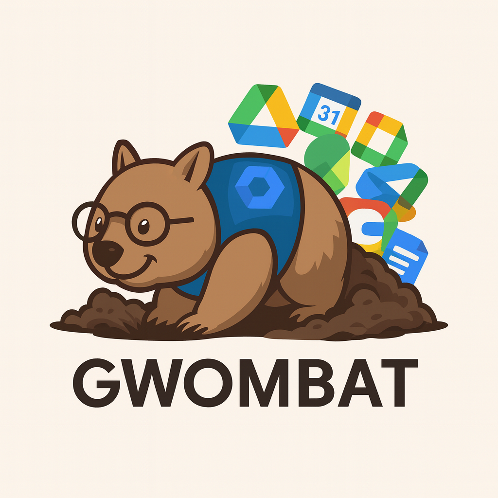

# GWOMBAT - Google Workspace Optimization, Management, Backups And Taskrunner

A comprehensive Google Workspace administration system providing account lifecycle management, file operations, shared drive management, user analysis, reporting, and system administration. GWOMBAT offers a complete suite of tools for managing Google Workspace environments with database tracking, verification, and automated workflows.

## 🚀 What is GWOMBAT?

GWOMBAT is an enterprise-grade Google Workspace administration platform that goes far beyond simple account management. It provides:

- **Complete Account Lifecycle Management** - From suspension through deletion with database tracking
- **Advanced File & Drive Operations** - Bulk file operations, shared drive cleanup, ownership management  
- **Comprehensive User Analysis** - File sharing analysis, ownership auditing, activity reports
- **Robust Reporting & Monitoring** - Daily reports, operation summaries, performance tracking
- **Secure System Administration** - Database backups, deployment automation, configuration management
- **Integrated Database System** - SQLite-based persistent state tracking and verification

## 📋 Complete Feature Overview

### 🔄 1. Suspended Account Lifecycle Management (8 Operations)
- **Add/Remove Temporary Hold** - Mark accounts for extended review periods
- **Add/Remove Pending Deletion** - Process accounts for final deletion with file markers
- **Single User Operations** - Interactive single-account processing
- **Batch Operations from Lists** - Process multiple accounts with progress tracking
- **Import from CSV** - Bulk import account lists with automatic processing
- **Preview Mode** - Dry-run operations to preview changes before execution
- **Database Integration** - Persistent tracking of all account states and history
- **Automated Verification** - Check account states match expected lifecycle stage

### 👥 2. User & Group Management (2 Operations)
- **File Ownership Audit** - Identify files owned by users in external folders
- **Orphaned File Collection** - Collect scattered files into designated folders

### 💾 3. File & Drive Operations (13 Operations)
- **Shared Drive Cleanup** - Remove pending deletion markers from shared drives
- **Interactive Drive Operations** - Manual review and processing of shared drive files
- **Admin Access Management** - Grant/revoke admin access to shared drives and files
- **Archived Drive Creation** - Create dedicated archive drives for departed users
- **URL Parsing & Search** - Accept drive URLs or search by name for easy identification
- **File Activity Analysis** - Analyze recent vs. old file activity patterns
- **Bulk File Operations** - Process hundreds of files with progress tracking
- **Ownership Transfer** - Transfer file ownership in bulk with verification
- **Group Management** - Backup/restore group memberships during transitions
- **Bulk Group Operations** - Add/remove users from groups in batch
- **Date Restoration** - Restore original file modification dates after operations
- **Preview Mode** - Dry-run all operations to preview changes
- **Command Transparency** - Display all GAM commands before execution

### 🔍 4. Analysis & Discovery (11 Operations)
- **Account Discovery & Scanning** - Automatically discover suspended accounts and categorize by stage
- **File Sharing Analysis** - Comprehensive analysis of user file sharing patterns
- **License Management** - Add/remove/audit Google Workspace licenses
- **Batch License Operations** - Process license changes across multiple users
- **User Activity Reports** - Generate detailed activity reports for individual users
- **Cross-Domain Sharing** - Identify files shared outside the organization
- **Permission Auditing** - Analyze file and folder permissions
- **Storage Usage Analysis** - Track storage consumption patterns
- **Collaboration Mapping** - Map user collaboration networks
- **External Sharing Reports** - Identify potential security risks
- **Compliance Reporting** - Generate reports for compliance requirements

### 📋 5. Account List Management (11 Operations)
- **Database-Driven Lists** - Create and manage account lists with tags
- **CSV Import/Export** - Import account lists from CSV with automatic processing
- **List Progress Tracking** - Monitor completion status of batch operations
- **Account Verification** - Verify account states match database expectations
- **Automated Discovery** - Scan Google Workspace and auto-create lists by stage
- **List Membership Management** - Add/remove accounts from lists
- **Bulk Processing** - Process entire lists with operation batching
- **List Statistics** - View progress and completion statistics
- **List Merging** - Combine multiple lists for complex operations
- **List Filtering** - Filter lists by criteria for targeted operations
- **List History** - Track changes and operations performed on lists

### 📈 6. Reports & Monitoring (11 Operations)
- **Daily Activity Reports** - Comprehensive daily summaries of all operations
- **Session Logging** - Detailed logs of all user sessions and activities
- **Operation Summaries** - Real-time summaries of batch operations
- **Performance Statistics** - Track operation duration and system performance
- **Error Monitoring** - Centralized error logging and analysis
- **Audit Trail** - Complete audit trail with session correlation
- **Log Management** - Automated log cleanup and retention management
- **Database Health** - Monitor database performance and integrity
- **System Status** - Real-time system health monitoring
- **Usage Analytics** - Track system usage patterns and trends
- **Compliance Reports** - Generate reports for compliance and audit requirements

### ⚙️ 7. System Administration (7 Operations)
- **Database Backup & Restore** - Automated database backups with Google Drive integration
- **Configuration Management** - Dynamic configuration with environment variables
- **Deployment Automation** - Secure git-based deployment with SSH key management
- **Dependency Checking** - Automated verification of system dependencies
- **Log Maintenance** - Automated log cleanup and archiving
- **Performance Optimization** - System performance monitoring and tuning
- **Security Management** - SSH key rotation, access control, and security auditing

## 🛠️ Advanced Technical Features

### Database System
- **SQLite Backend** - Lightweight, serverless database for persistence
- **7-Table Schema** - Comprehensive data model for accounts, lists, operations, and audit trails
- **ACID Compliance** - Ensure data integrity across all operations
- **Automated Backups** - Regular backups to local storage and Google Drive
- **Migration Support** - Schema versioning and upgrade capabilities
- **Performance Optimization** - Indexed queries and optimized data structures

### Security & Compliance
- **SSH Key Authentication** - Dedicated deployment keys with password protection
- **Audit Logging** - Complete operation history with session correlation
- **Environment Isolation** - No secrets in code, all configuration via .env files
- **Access Control** - Granular permission management for different operations
- **Data Protection** - Encryption at rest and secure data handling
- **Compliance Support** - Built-in reporting for regulatory requirements

### User Experience
- **Intuitive Menu System** - Logically organized by function type
- **Universal Navigation** - 'm' (main menu) and 'x' (exit) options on all screens
- **Progress Tracking** - Real-time progress bars for long-running operations
- **Command Transparency** - Display all GAM commands before execution
- **Input Validation** - Smart input parsing including URL extraction
- **Error Handling** - Graceful error handling with informative messages
- **Dry-Run Mode** - Preview all operations before execution

## 🔧 Installation & Configuration

### Prerequisites
- **GAM (Google Apps Manager)** - Primary Google Workspace interface
- **SQLite** - Database backend (usually pre-installed)
- **Git/SSH** - Secure deployment infrastructure
- **Bash 4+** - Shell scripting environment
- **expect** - SSH key password automation

### Quick Start
```bash
# 1. Clone and configure
git clone git@github.com:mattbaya/gwombat.git
cd gwombat
cp .env.template .env
# Edit .env with your configuration

# 2. Create SSH deployment key (optional)
ssh-keygen -t ed25519 -C "gwombatgit-key" -f ~/.ssh/gwombatgit-key

# 3. Run GWOMBAT
./gwombat.sh
```

### Environment Configuration

**Local Development (.env)**:
```bash
# Domain and Organization Configuration
DOMAIN="your-domain.edu"
ADMIN_EMAIL="gwombat@your-domain.edu"
ADMIN_USER="your-actual-admin@your-domain.edu"  # Your actual admin user

# Production Server Configuration (for deployment)
PRODUCTION_SERVER="your-server.edu"
PRODUCTION_USER="your-user"
GWOMBAT_PATH="/opt/gamera/your-path/gwombat"

# SSH Configuration (optional, for deployment)
SSH_KEY_PATH="$HOME/.ssh/gwombatgit-key"
SSH_KEY_PASSWORD="your-secure-password"

# Organizational Unit Paths
SUSPENDED_OU="/Suspended Users"
PENDING_DELETION_OU="/Suspended Users/Pending Deletion"
TEMPORARY_HOLD_OU="/Suspended Users/Temporary Hold"
EXIT_ROW_OU="/Suspended Users/Exit Row"

# GAM Configuration
GAM_PATH="/usr/local/bin/gam"
GAM_CONFIG_PATH="/home/your-user/.gam"

# Google Drive Configuration
DRIVE_LABEL_ID="your-drive-label-id"
```

**Production Server (server.env)**:
```bash
# Server-specific configuration
GWOMBAT_PATH="/opt/production/path/gwombat"
GAM_PATH="/usr/local/bin/gam"
DOMAIN="your-domain.edu"
# ... additional server-specific settings
```

## 📊 Database Schema

GWOMBAT uses a comprehensive SQLite database with 7 main tables:

- **accounts** - Core account information and current lifecycle stage
- **account_lists** - List/tag definitions for grouping accounts
- **account_list_memberships** - Many-to-many account-list relationships  
- **stage_history** - Complete lifecycle change tracking
- **verification_status** - Stage-specific verification results
- **operation_log** - Audit trail for all operations
- **config** - System configuration storage

## 🔍 Usage Examples

### Account Lifecycle Management
```bash
# Launch GWOMBAT and select Account Lifecycle Management
./gwombat.sh

# Process multiple accounts
Select: 1. Suspended Account Lifecycle Management
Select: 4. Batch operations from account list
Select your account list and operation type
```

### Shared Drive Operations
```bash
# Clean up shared drives
Select: 3. File & Drive Operations  
Select: 1. Clean shared drive

# Enter drive URL or search by name
Option 1: Paste https://drive.google.com/drive/folders/your-drive-id
Option 2: Search for "Department Files"
```

### Analysis & Discovery
```bash
# Discover and categorize accounts
Select: 4. Analysis & Discovery
Select: 1. Account discovery and scanning

# Generate comprehensive reports
Select: 4. Analysis & Discovery
Select: 3. File sharing analysis
```

## 📁 File Organization

```
gwombat/
├── gwombat.sh                     # Main application (6800+ lines)
├── shared-utilities/              
│   ├── database_functions.sh      # Database operations (700+ lines)
│   ├── fixshared.sh              # Shared drive utilities
│   ├── recent4.sh                # File activity analysis
│   └── [8 other utility scripts]
├── database_schema.sql            # Complete SQLite schema
├── deploy.sh                      # Secure deployment automation
├── .env.template                  # Local configuration template  
├── server.env.template            # Server configuration template
├── README.md                      # This comprehensive documentation
├── CLAUDE.md                      # AI development context
├── DEPLOYMENT.md                  # Deployment documentation
├── REQUIREMENTS.md                # System requirements
├── assets/                        # Graphics and documentation assets
├── config/                        # Runtime configuration
├── logs/                          # Session and operation logs
├── reports/                       # Generated reports
├── backups/                       # Database and configuration backups
└── tmp/                          # Temporary processing files
```

## 🚀 Recent Enhancements (August 2025)

### Major Updates
- **URL Parsing & Search** - Accept Google Drive URLs or search drives by name
- **Command Transparency** - Display all GAM commands before execution
- **Fixed Summary Counters** - Accurate operation summaries and statistics
- **Enhanced Navigation** - Universal x/m options for exit and main menu
- **Security Improvements** - Purged sensitive files from git history
- **Admin User Configuration** - Configurable admin user via ADMIN_USER variable

### Security Enhancements
- **Complete History Cleanup** - Removed all sensitive files from git history
- **Configurable Admin User** - No more hardcoded admin accounts
- **Environment Variables** - All sensitive configuration moved to .env files
- **SSH Key Management** - Automated deployment with secure key handling

## 🔐 Security Features

- **Environment-Based Configuration** - All sensitive data in .env files
- **SSH Key Deployment** - Automated secure deployment to production
- **Complete Audit Trail** - Every operation logged with session correlation
- **Database Backups** - Automated backups with Google Drive integration
- **Access Control** - Role-based access to different operations
- **Data Encryption** - Secure handling of sensitive account information
- **Git Security** - Sensitive files excluded from version control

## 📋 System Requirements

### Required
- **Linux/macOS** - Primary development and production platforms
- **Bash 4.0+** - Core scripting environment
- **GAM** - Google Apps Manager for Google Workspace integration
- **SQLite** - Database backend (usually pre-installed)
- **Git** - Version control and deployment
- **SSH** - Secure remote access for deployment

### Optional
- **expect** - Automated SSH key password entry for deployment
- **Google Drive API** - Automated backup uploads
- **curl/wget** - Additional web-based integrations

## 🌟 Why Choose GWOMBAT?

1. **Comprehensive Solution** - Complete Google Workspace administration in one platform
2. **Database-Driven** - Persistent state tracking and verification across all operations
3. **Enterprise-Grade** - Built for large-scale Google Workspace environments
4. **Security-First** - Complete audit trails, secure deployment, environment isolation
5. **User-Friendly** - Intuitive menus with progress tracking and error handling
6. **Extensible** - Modular design allows easy addition of new features
7. **Transparent** - Shows exactly what commands are being executed
8. **Reliable** - Comprehensive error handling and rollback capabilities

## 🚀 Future Enhancements

- **Web Dashboard** - Browser-based interface for monitoring and basic operations
- **API Integration** - RESTful API for external system integration
- **Workflow Automation** - Scheduled and triggered workflow execution
- **Multi-Domain Support** - Manage multiple Google Workspace domains
- **Advanced Analytics** - Machine learning-powered insights and recommendations
- **Mobile Interface** - Mobile-responsive dashboard for on-the-go monitoring

---

GWOMBAT represents the evolution from simple script collections to a comprehensive, enterprise-grade Google Workspace administration platform. With its database-driven architecture, security-first design, and comprehensive feature set, GWOMBAT provides everything needed to manage Google Workspace environments at scale.